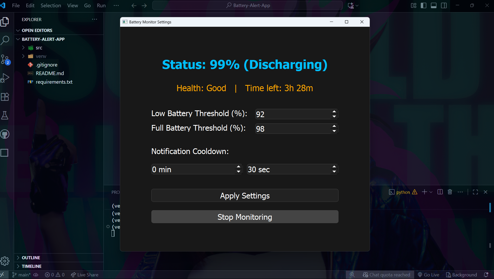
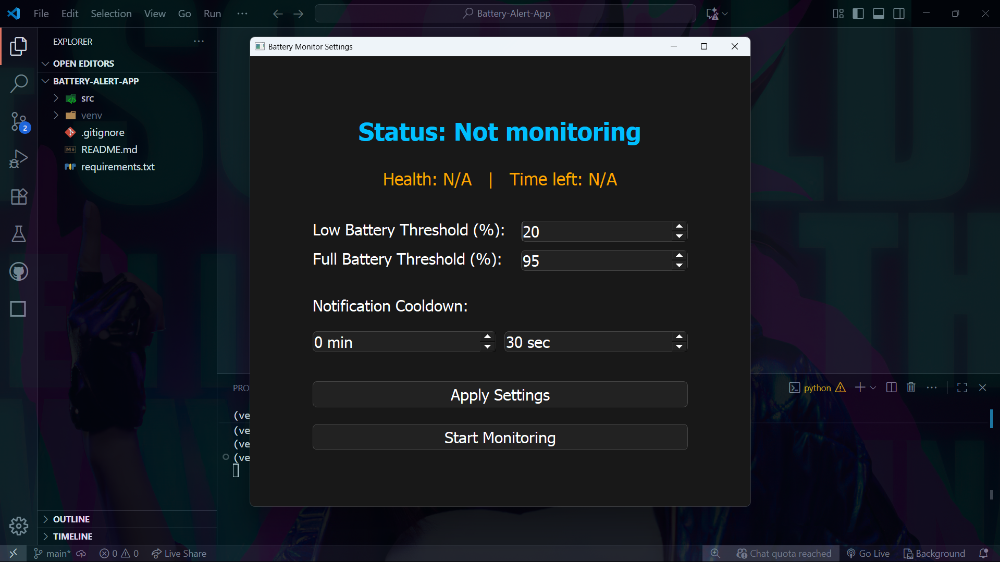
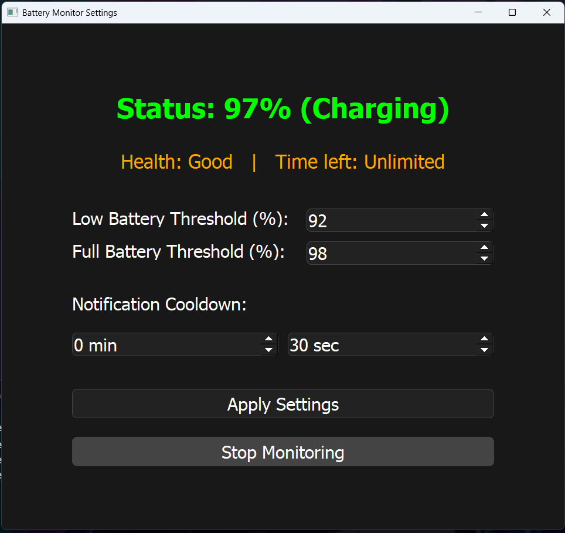
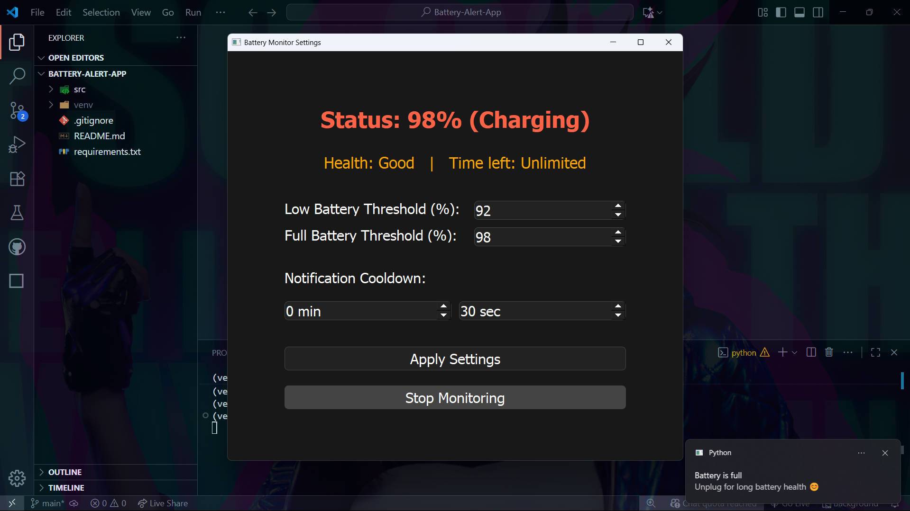

# ⚡ Battery Alert App  

> A modern, customizable **Windows battery monitoring application** with a sleek PyQt5 GUI.  
> Get **real-time notifications** for low and full battery, track **battery health**, view **time estimates**, and stay in control of your power usage!  



---

## ✨ Features  

✅ **Customizable thresholds** for low and full battery alerts  
✅ **User-defined cooldown interval** between repeated alerts  
✅ **Real-time battery status** (charging/discharging, percentage)  
✅ **Battery health indicator** (*Good / Moderate / Low*)  
✅ **Estimated time remaining** until empty/full  
✅ **Modern PyQt5 UI** with dark mode & accessible controls  
✅ **Color-coded status bar:**  
   - 🔵 Discharging  
   - 🟢 Charging (below max threshold)  
   - 🔴 Alert (low or full threshold reached)  
✅ **Cross-platform notifications** via Plyer  
✅ **Instant setting updates** (no restart required)  

---


## 📂 Project Structure  

```
battery-monitor-app
├── src
│   ├── main.py              # Entry point (launches the GUI)
│   ├── ui
│   │   └── main_window.py   # PyQt5 interface & logic
│   ├── notifications
│   │   └── notifier.py      # Notification handling (plyer)
│   └── config
│       └── settings.py      # Threshold & config handling
├── requirements.txt         # Dependencies
└── README.md                # Documentation
```

---

## ⚙️ Installation  

1. **Clone the repository:**  
   ```bash
   git clone <repository-url>
   cd battery-monitor-app
   ```

2. **Create & activate a virtual environment (recommended):**
   ```bash
   python -m venv venv

   # On Windows (CMD):
   venv\Scripts\activate

   # On Windows (PowerShell):
   .\venv\Scripts\Activate.ps1
   ```

3. **Install dependencies:**
   ```bash
   pip install -r requirements.txt
   ```

---

## ▶️ Usage  

Run the app with:
```bash
python src/main.py
```
This will launch the graphical user interface (GUI).
- **GUI Window**
  
---

## 🖥️ How It Works  

1. Set thresholds for low & full battery.  
2. Adjust cooldown for notification frequency.  
3. Hit **Apply Settings** → Preferences update instantly.  
4. Press **Start Monitoring** → Battery monitoring begins.  

**Status bar colors:**  
- 🔵 Discharging  
- 🟢 Charging (below max threshold)  
- 🔴 Alert (low or full threshold)  

**View:**  
- 📊 Health: Good / Moderate / Low  
- ⏳ Time left: Estimated charge/discharge duration  

**Notifications:** Receive alerts when thresholds are crossed!  

---

## 🎨 Customization  

⚡ Thresholds & cooldown are fully adjustable anytime.  
🌓 Dark mode enabled by default for a modern look.  
📐 Responsive design → Adapts to resizing, but never shrinks below usability standards.  

---

## 🔔 Notifications  

⚠️ **Low battery:** Triggers when ≤ low threshold (while discharging).  
🔋 **Full battery:** Triggers when ≥ full threshold (while charging).  
⏱️ **Cooldown interval:** Controls how often reminders repeat (default: 30s).  

---

## 📝 Notes  

- Battery health & time remaining are estimated using OS + psutil data.  
- Advanced info like Design Capacity / Full Charge Capacity is not shown (extendable via Windows WMI).  
- All settings are session-based (not saved after exit).  

---

## 📦 Dependencies  

- **PyQt5** → GUI  
- **psutil** → Battery info  
- **plyer** → System notifications  

Install all with:
```bash
pip install -r requirements.txt
```

---

## ✨ More Features  to come

- **Show battery health and estimated time remaining.** <br>
- **Option to run at Windows startup.** <br>
- **Custom notification sounds.** <br>
- **Dark/light mode for UI.** <br>
- **Log battery history and export as CSV.** <br>
- **System tray icon for quick access. Multi-language support.**


---


## 🤝 Contributing  

Contributions are welcome! 🎉  
- Open an issue for bugs/features  
- Submit a pull request for improvements  

---

## 📸 Screenshots  


- **After Setting Thresholds**
  
- **Min Thresholds**
  
- **Max Thresholds**
  


---


<!--# Battery-Alert-App

A modern, customizable Windows battery monitoring application with a graphical user interface (GUI).  
Get real-time notifications for low and full battery, view battery health, estimated time remaining, and more.

---

## Features

- **Customizable thresholds** for low and full battery alerts.
- **User-defined notification cooldown** (interval between repeated alerts).
- **Real-time battery status** (charging/discharging, percentage).
- **Battery health indicator** (Good/Moderate/Low).
- **Estimated time remaining** until battery is empty/full.
- **Modern, responsive PyQt5 UI** with dark mode and large, accessible controls.
- **Color-coded status:**  
  - Blue: Discharging  
  - Green: Charging (below max threshold)  
  - Red: Alert (low or full threshold reached)
- **Cross-platform notifications** using Plyer.
- **Settings are applied instantly** via the GUI.

---

## Project Structure

```
battery-monitor-app
├── src
│   ├── main.py                # Entry point of the application (launches the GUI)
│   ├── ui
│   │   └── main_window.py     # PyQt5 user interface and logic
│   ├── notifications
│   │   └── notifier.py        # Handles notification logic (using plyer)
│   └── config
│       └── settings.py        # Configuration for battery thresholds
├── requirements.txt           # Project dependencies
└── README.md                  # Project documentation
```

---

## Installation

1. **Clone the repository:**
   ```
   git clone <repository-url>
   cd battery-monitor-app
   ```

2. **Create and activate a virtual environment (recommended):**
   ```
   python -m venv venv
   # On Windows:
   venv\Scripts\activate
   # On PowerShell:
   .\venv\Scripts\Activate.ps1
   ```

3. **Install the required dependencies:**
   ```
   pip install -r requirements.txt
   ```

---

## Usage

To run the application, execute:
```
python src/main.py
```
This will launch the graphical user interface (GUI).

---

## How to Use

- **Set your desired low and full battery thresholds** using the spin boxes.
- **Set the notification cooldown** (how often you want to be reminded).
- Click **Apply Settings** to save your preferences.
- Click **Start Monitoring** to begin battery monitoring.
- The **status bar** at the top shows real-time battery status and changes color:
  - **Blue:** Discharging
  - **Green:** Charging (below max threshold)
  - **Red:** Alert (low or full threshold reached)
- Below the status, you will see:
  - **Health:** (Good/Moderate/Low, based on battery %)
  - **Time left:** Estimated time remaining (if available)
- You will receive system notifications when thresholds are crossed, with a cooldown between repeated alerts.

---

## Customization

- **Thresholds and cooldown** can be changed at any time in the GUI.
- **UI is responsive** and adapts to window resizing, but cannot be made smaller than half the screen for usability.

---

## Notifications

- **Low battery:** When battery is at or below your set minimum and not charging.
- **Full battery:** When battery is at or above your set maximum and charging.
- **Notification interval:** Controlled by the cooldown setting (default 30 seconds).

---

## Notes

- **Battery health and time left** are estimated based on current battery percentage and OS-provided information.
- **Design Capacity / Full Charge Capacity:** Not shown, as this information is not available via `psutil` (for advanced users, you may extend the app to use Windows WMI for this).
- **All settings are session-based** (not persisted after closing the app).

---

## Dependencies

- [PyQt5](https://pypi.org/project/PyQt5/) (UI)
- [psutil](https://pypi.org/project/psutil/) (battery info)
- [plyer](https://pypi.org/project/plyer/) (notifications)

Install all with:
```
pip install -r requirements.txt
```

---

## Contributing

Feel free to submit issues or pull requests if you have suggestions or improvements for the project.


## Screenshots


  
----->
